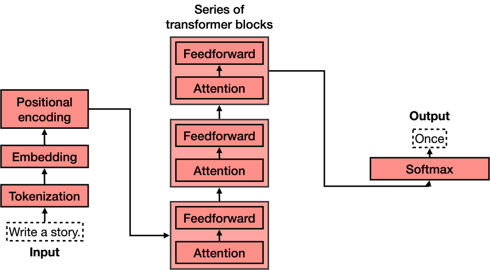

# Transformers

Transformers are considered novel deep feed-forward artificial neural network architectures that leverage self-attention mechanisms and can handle long-range correlations between the 
input-sequence items. Thanks to their massive success in the industry and academic research, bountiful transformer architectures — a.k.a. X-formers — have been proposed by researchers since
their inception in 2017, and have been adopted in a substantial number of domains such as — initially was proposed for — natural language processing (NLP), computer 
vision (CV), audio and speech processing, chemistry, and life sciences; they can achieve SOTA performances in the disciplines mentioned earlier.

